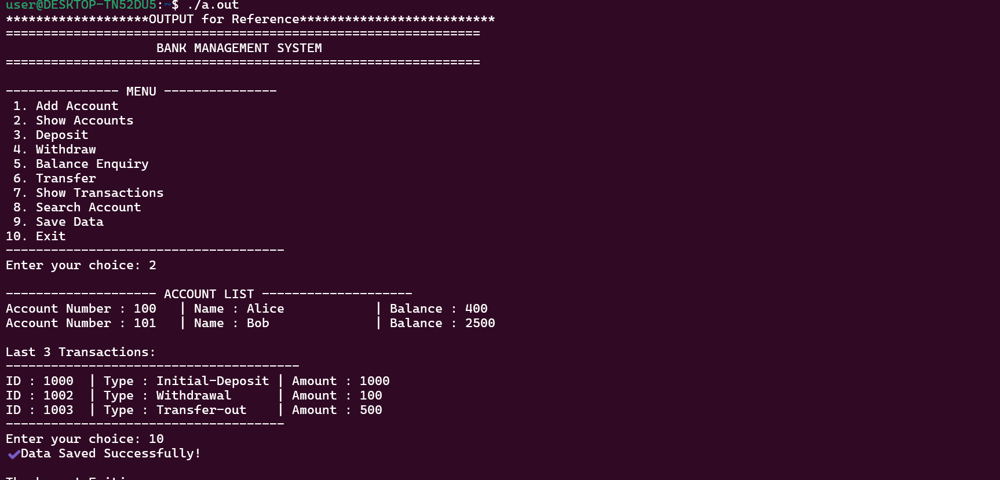

---

# 📌 **Bank Management System – C Project**

A simple but powerful **Bank Management System** implemented in **C**, featuring account creation, deposit/withdrawal operations, fund transfer, transaction history, and persistent file storage.
This project is designed with clean data structures, file handling, linked lists, and circular transaction logs—ideal for learning.

---

## 🚀 **Features**

### ✔ **Account Management**

* Create new bank accounts
* Search accounts
* Display all accounts

### ✔ **Banking Operations**

* Deposit money
* Withdraw money
* Transfer funds between accounts

### ✔ **Transaction Management**

* Stores last **5 transactions per account**
* Circular transaction buffer (FIFO)
* Auto-generated Transaction IDs

### ✔ **Persistent Storage**

* Saves all account data to **bank.dat**
* Loads previous data automatically at startup

### ✔ **Data Structures Used**

* **Singly Linked List** for storing accounts
* **Array of Structs** for storing transactions per account
* **Circular Indexing** for transaction history

---

## 🧾 **Project Structure**

```
📂 Bank_Managment_System_C
 ├── Bank_System.c
 ├── Images/
 │     ├── Flowchart.png
 │     ├── Bank_Sample_output.png
 ├── 00_sample written_output_format/
 ├── bank.dat   (auto-generated)
 ├── README.md
```

---

## 🖥 **How It Works (Program Flow)**

1. Load previous data from file
2. Display main menu
3. Perform user-selected operation
4. Save changes
5. Exit safely

---

## 📊 **Flowchart**
                ┌────────────────────────┐
                │     Program Start      │
                └───────────┬────────────┘
                            │
                ┌───────────▼─────────────┐
                │    Load_File()          │
                │ (Load saved accounts)   │
                └───────────┬────────────┘
                            │
                ┌───────────▼─────────────┐
                │     Display Menu        │
                └───────────┬────────────┘
                            │
                ┌───────────▼─────────────┐
                │    Get User Choice      │
                └───────────┬────────────┘
                            │
        ┌──────────────────────────────────────────────────────┐
        │                      SWITCH(choice)                   │
        └──────────────────────────────────────────────────────┘
            │           │           │          │       │
            ▼           ▼           ▼          ▼       ▼

   ┌─────────────┐ ┌────────────┐ ┌──────────────┐ ┌──────────────┐ ┌───────────────┐
   │ Add Account │ │  Deposit   │ │   Withdraw    │ │  Balance Enq │ │   Transfer     │
   └──────┬──────┘ └─────┬──────┘ └──────┬───────┘ └──────┬───────┘ └──────┬────────┘
          │               │               │                │                 │
          ▼               ▼               ▼                ▼                 ▼
   (update list)     (update bal)   (update bal)    (print balance)   (update both accounts)
          │               │               │                │                 │
          ▼               ▼               ▼                ▼                 ▼
      addTransaction()  addTransaction() addTransaction()   │          addTransaction()

                            │
              ┌─────────────▼────────────┐
              │   Show Accounts /         │
              │   Show Transactions /     │
              │   Search Account /        │
              │   Save_File()             │
              └─────────────┬────────────┘
                            │
                ┌───────────▼────────────┐
                │     Exit Option?       │
                └───────┬────┬──────────┘
                        │    │No
                        │Yes ▼
                ┌───────▼────────┐
                │   Save_File()   │
                └───────┬────────┘
                        │
                ┌───────▼────────┐
                │   Program End   │
                └─────────────────┘

*(This will preview automatically once uploaded)*

---

## 📸 **Sample Output**

```

```

---

## 🧠 **Core Concepts Demonstrated**

| Concept             | Description                         |
| ------------------- | ----------------------------------- |
| **Structures in C** | Account & Transaction management    |
| **Linked Lists**    | Dynamic account storage             |
| **File Handling**   | Binary file I/O using fread/fwrite  |
| **Circular Buffer** | For 5-transaction history           |
| **Modularity**      | Clean function-based implementation |
| **Error Handling**  | Input validation & safe operations  |

---

## 🏗️ **Compilation & Execution**

### **Compile**

```bash
gcc Bank_System.c -o bank
```

### **Run**

```bash
./bank
```

---

## 📚 **Menu Options**

| Option | Description              |
| ------ | ------------------------ |
| 1      | Add Account              |
| 2      | Show All Accounts        |
| 3      | Deposit Money            |
| 4      | Withdraw Money           |
| 5      | Balance Enquiry          |
| 6      | Transfer Funds           |
| 7      | Show Last 5 Transactions |
| 8      | Search Account           |
| 9      | Save Data to File        |
| 10     | Exit Program             |

---

## ⭐ **Why This Project Stands Out (Interview Edge)**

* Demonstrates **strong understanding of C fundamentals**
* Uses **data structures & algorithms** effectively
* Shows **real-world problem solving**
* Implements **persistent storage like a real bank system**
* Clean coding structure suitable for scaling

---

## 🤝 **Contributions**

Feel free to fork this repository and submit pull requests to improve functionality or code readability.

---

## 🏅 **Author**

**Raj-GitCode**
📌 *Bank Management System in C*

---

If you'd like, I can also create:

✔ Stylish GitHub profile README
✔ Explanation PDF
✔ UML Diagram
✔ Advanced version using file indexing

Just tell me!
